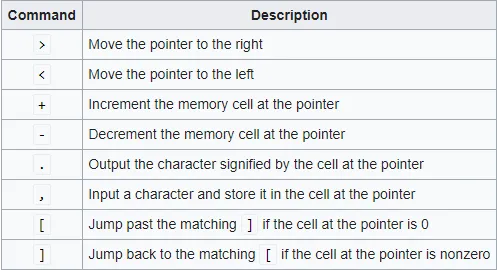
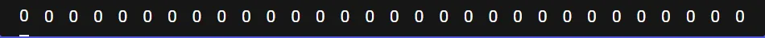
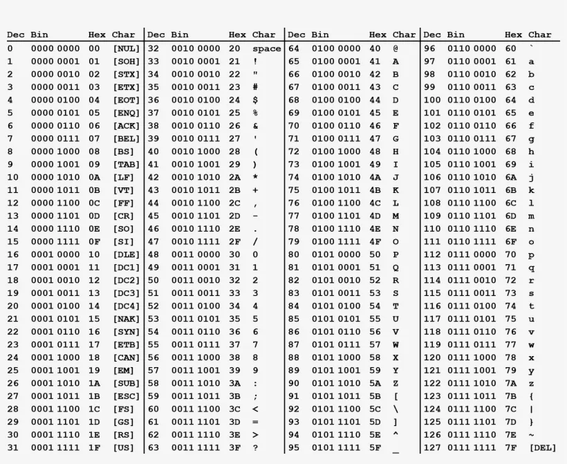
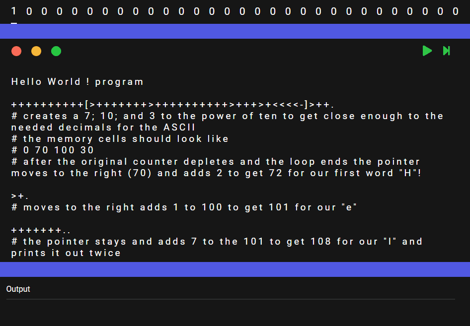

For the last few months I have been obsessed with learning one of most well known and famous esoteric programming languages called **Brainf*ck** (gasp). First of all, forgive the rather harsh language but my journey through this rather niche and useless subject has taught me a few interesting points in intellectual development, self improvement, and the pure comedy of human nature of spending countless of hours on something just out of sheer curiosity.

## What is Esolang?

Before we can understand what Brainf*ck is, first we need to understand what an esoteric programming language is. According to the esolang wiki on what an esoteric programming language is :

> “An **esoteric programming language** (ess-oh-terr-ick), or **esolang**, is a computer programming language designed to experiment with weird ideas, to be hard to program in, or as a joke, rather than for practical use.”

From this, esolang gives us a unique view on a particular aspect of computer science that I think most don’t see, which is the too much time on their hand nerds with nothing else to do for the weekend. And I mean this in the most positive way possible! (mostly because I am that nerd).

## What is Brainf*ck?

Now that we understand what an esolang even is, lets get to the juicy part!.

This article is not meant for a comprehensive guide on how to code in Brainf*ck, for that I highly [recommend roachhd “Basics of Brainf*ck”](https://gist.github.com/roachhd/dce54bec8ba55fb17d3a) it gives a good and concise explanation on how the language works, and frequently used basic algorithms.

But as a general overview, Brainf*ck is an esolang created by [Urban Müller](https://esolangs.org/wiki/Urban_M%C3%BCller), a Swiss physics student with the goal of creating a programming language with the smallest compiler size possible, published in 1993 it has garnered a notorious reputation as “The hardest programming language to exist” even well known in the mainstream general IT circles.

## The (very) Basics of Brainf*ck

Brainf*ck, contrary to it’s reputation is less “complicated” and more “tedious” from my experience. There’s basically only 2 main components to the language, the **Memory cells** and the **Commands**. Both of which have very basic elements to them as well, and from this simplicity which makes the program seems daunting to those uninitiated. But as you look more into it, the concept of the language as a whole gets easier and easier. It’s just **REALLY** really tedious.

Basically Brainf*ck consists of :

1. **Memory cells** = What you can say as the “memory tape” of the language which stores all the data.
2. **Commands** = There’s only 8 commands in the whole language.

Those commands are :

And the **Memory cell** and **Pointer** can be visualized as a long strip of tape as such :

And these 2 very simple components put together made such an interesting, simple, yet fully functional (though not practical) programming language that can theoretically perform any tasks a normal language can.

As an example, the most common way of using this language is to just simply output words with ASCII decimal. Lets try to write “Hello World”!.

First we need to consult our trusty ASCII table :

Now from our table we know that we need

- 72(H)
- 101(e)
- 108(l)
- 111(o)
- 32(space)
- 87(W), 111(o)
- 114(r), 108(l)
- 100(d), and 33(!).

And now all we need is to figure out how to put them all in their cells!. A basic Hello World program can be written up as such:

    Hello World ! program

    ++++++++++[>+++++++>++++++++++>+++>+<<<<-]>++. 
    # creates a 7; 10; and 3 to the power of ten to get close enough to the needed decimals for the ASCII
    # the memory cells should look like 
    # 0 70 100 30
    # after the original counter depletes and the loop ends the pointer moves to the right (70) and adds 2 to get 72 for our first word "H"!

    >+.
    # moves to the right adds 1 to 100 to get 101 for our "e"

    +++++++..
    # the pointer stays and adds 7 to the 101 to get 108 for our "l" and prints it out twice

    +++.
    # the pointer stays and adds 3 to the 108 to get 111 for our "o"

    >++.
    # the pointer moves to the right to get 30 and adds 2 to get out "space"

    # our current memory should look like
    # 0 70 111 32
    #          ^   (with the pointer currently being at 32)

    <<+++++++++++++++.
    # the pointer moves 2 to the left and adds 15 to 72 to get 82 for our "w"

    >.
    # the pointer moves to the right and prints another "o"

    +++.
    # adds 3 to the 111 to get 114 and prints "r"

    ------.
    # decrement 6 to our 111 to get 108 to print "l"

    --------.
    # decrement by 8 to our 108 to get 100 to print (d)

    # our current memory should look like
    # 0 70 114 32
    #       ^    (with the pointer currently being at 32)

    >+.
    # adds 1 to the 32 to get 33 to print "!" 

And that’s how you write Hello World in Brainf*ck!, it’s not the most practical per say but hey, it works!. Here is how it runs :

## What’s the Point??

Now you might be wondering what’s the point of all this, why you should even bother reading all of this, and why I even started learning this arguably interesting but still largely *useless* venture.

I say *useless* because from a practical standpoint, all of this knowledge has no real use outside of my own curiosity. I started diving more into the language when I wanted a unique and kind of nerdy way of spicing up my Instagram description. And starting from honestly a trivial desire gave me such a wealth of knowledge and newfound understanding on a lot of things, particularly computer science that I’ve never found an appreciation for, which can be boiled down to :

### ✨ The Charm of Useless Knowledge ✨

In our ever more monetized and commodified society, especially with the commodification of computer science. The experience of most modern new programmers through the journey of computer science is in my opinion and from my own personal experience, a highly mechanical and soulless journey. The people that flocked into the field in hopes of the fabled gold mines that the technocrats and pseudo-futurists promised them, in a time of rapidly changing industry and technology that is reshaping our society in a way that we don’t see every few centuries. Computer Science has been the go to field for people looking to adapt to a seemingly infinitely changing world that can leave them in the dust of unemployment or career slump in a flash.

While I don’t see this as an inherently bad thing, I’m not one for advocating to somehow gatekeep the accessibility of computer science from the masses. I do think this overly commodified and corporatized influx of new students (such as myself) tend to mechanize the field, they teach students “what the newest hottest job positions is” and “the best programming language to learn in 2023 [REAL]!” while ignoring the fundamental and in my opinion the most interesting and fun aspect of Computer Science, the **Science** part!.

For a few years now my software engineering classes and teachers have just been ramming down “hey, learn this framework” or “master this language”, and for a long while it’s what I’ve always thought of as computer science. It’s the class that does the coding.

But after going through this whole journey for a few months, learning the *useless* language, scouring the esolang wiki to find more cool, interesting, or just downright silly languages that I can find. It gave me a whole new appreciation for computer science as a whole field, to explore new and just funny ideas, to find such passionate and smart people that took their time for such a silly and rather futile exercise, just because they can. The practically useless knowledge that I will never find use practically in the real world, has taught me more about passion and the ever quenching thirst for knowledge.

