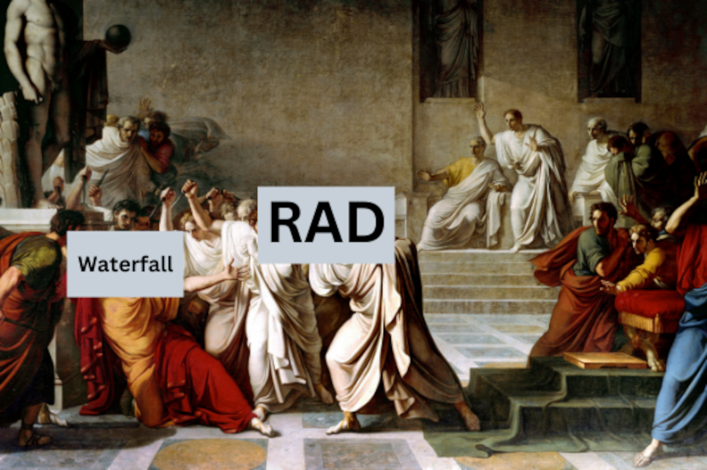

Rapid Application Development (RAD) or Rapid Prototyping is a software development process model that utilizes a combination of incremental and iterative model. RAD emphasises short, and fast development cycles. **Time** is an important limitation for this model.

RAD uses an iterative and incremental method of developing systems where a working model of the system is constructed early in the development phase with the aim of establishing user requirements and is subsequently discarded. The working model is used only occasionally as a basis for the design and implementation of the final system.µ#[1](https://anakkos21.blogspot.com/2011/11/perbedaan-sdlc-rad-dan-jad.html)#µ

## Short History

An SDLC that was born out of waterfall's tyrannical rule. Rapid Application Development or RAD, aims to provide an alternative to waterfall that is more flexible, user oriented, and iterative development, where the RAD model allows a faster software development than the waterfall model.

RAD killing the tyrant waterfall circa 1991

Rapid Application Development is a software development methodology introduced in the 1990s and presented in the form of the book *Rapid Application Development* by James Martin. A reaction to the established methodologies of the time which emphasised "careful and prolonged requirements gathering before the actual software development began."µ#[2](https://www.bestpricecomputers.co.uk/glossary/rapid-application-development.htm)#µ

Although James Martin was not the "creator" of the RAD SDLC, there are several examples of RAD principles being used such as Barry Boehman with the creation of the Spiral model. It was James Martin who formalised RAD as an SDLC model in its own right.

## Structure

The foundations of RAD as a flexible system is very clear when we look at the Life Cycle modelµ#[3](https://codebots.com/app-development/what-is-rapid-application-development-rad)#µ :

SDLC RAD Life Cycle Visualization

1. **Define project requirements:**
The initial phase where all relevant parties define the major requirements needed.
2. **Prototype:**
A continuous interactive process that allows users to understand, modify, and eventually approve a working model of the system that meets their needs.
3. **Rapid Construction and Feedback Gathering:**
Rapid Construction is where application coding, system testing, and unit integration take place, turning prototypes and beta systems into working models.
4. **Finalise product / implementation:**
The final phase of Rapid Application Development, where developers address the technical debt incurred in early prototyping, optimising implementation to improve stability and maintainability as they finalise the product for deployment.

## RAD vs Tradition

Differences between the traditional SDLC Model and RADµ#[4](https://www.wavemaker.com/rapid-application-development-vs-traditional-sdlc/)#µ :

| Parameter                       | RAD                                                                                                    | Traditional SDLC                                                                                                         |
|---------------------------------|--------------------------------------------------------------------------------------------------------|--------------------------------------------------------------------------------------------------------------------------|
| Application Development Process | Incremental and iterative                                                                              | Linear and predictive                                                                                                    |
| Team Structure                  | Small and agile teams                                                                                  | Large teams with strictly defined roles                                                                                  |
| Productivity and Flexibility    | High productivity and flexibility due to iterations                                                    | Lower productivity and flexibility due to linear, rigid approach                                                         |
| Documentation                   | Minimal Documentation                                                                                  | Full Specification Documentation                                                                                         |
| Time and Cost Estimation        | Variable depending on the iterations                                                                   | Fixed based on the agreed upon specification                                                                             |
| Testing                         | Testing is performed at every iteration                                                               | Testing is performed after completion of the coding phase                                                               |
| End User Interaction            | Extensive user interaction with reviews and suggestions.                                               | User is involved at the beginning during the requirements stage                                                          |
| Predefined Elements             | Use of predefined themes, templates, layouts and micro applications | Elements have to be designed and constructed from the ground up as per project requirements and hence, are not reusable |

## Pros and Cons of RAD

The pros and cons of RADµ#[5](https://blog.airbrake.io/blog/sdlc/rapid-application-development)#µ :

| Pros                                      | Cons                                   |
|-------------------------------------------|----------------------------------------|
| Measurable Progress                       | Depends Upon Skilled Developers        |
| Compartmentalization of System Components | Requires Modular Systems               |
| Rapid, Constant User Feedback             | Difficulty Within Large-Scale Projects |
| Simple Adaptability                       | Demands Frequent User Interfacing      |

---

## References

- Perbedaan SDLC, RAD, dan JADµ#[1](https://anakkos21.blogspot.com/2011/11/perbedaan-sdlc-rad-dan-jad.html)#µ
- Rapid Application Developmentµ#[2](https://www.bestpricecomputers.co.uk/glossary/rapid-application-development.htm)#µ
- What is Rapid Application Development (RAD)?µ#[3](https://codebots.com/app-development/what-is-rapid-application-development-rad)#µ
- RAD vs Traditional SDLCµ#[4](https://www.wavemaker.com/rapid-application-development-vs-traditional-sdlc/)#µ
- What Is Rapid Application Development (Rad)µ#[5](https://blog.airbrake.io/blog/sdlc/rapid-application-development)#µ
