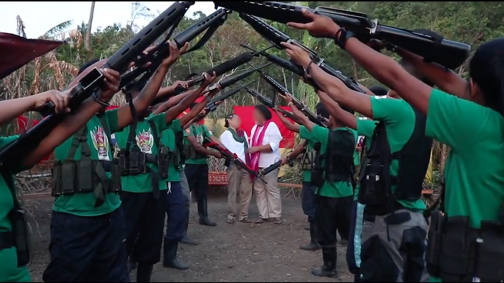
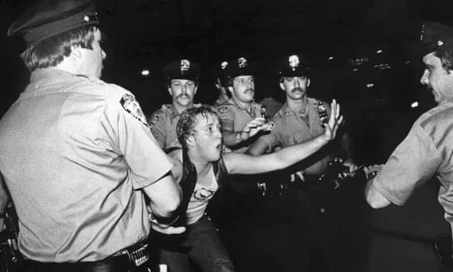
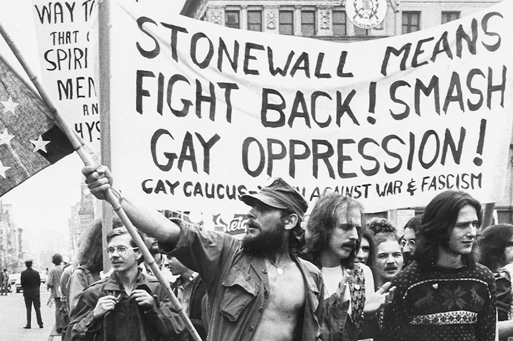
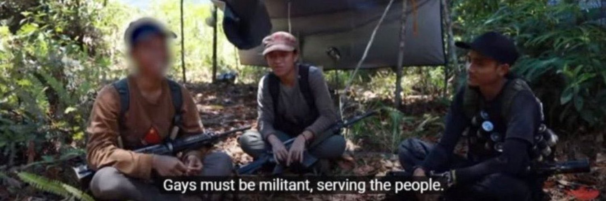

As June rolls around, the topic of Pride Month has circulated everyones news cycle, whether it be positive or negative. It can't be ignored though how the mainstream image of "Pride Month", largerly revolves around celebrations in western nations i.e America, Netherlands, UK, etc etc.  

While this image is not inherently *wrong*, it does create a western-centric view of queer culture and development that can be quite damaging. Not only to westerners which creates a false image that queers **only** exists in the west, creating an orientalist view of queers around the world, it can also be damaging to queers in non western nations that makes them feel isolated and lonely in a seemingly more and more violent and hostile society towards queer people.

I know my experience as a young queer person feeling isolated, lonely, seeing the pride marches abroad, how they seem to be more accepting than what I experience in my own home. It made me jealous, bitter even, to my friends abroad that can express and live life in a way that I can't even imagine myself doing in my wildest dreams.

But what if I told you that the first government to **fully legalize** same-sex marriage is not the Netherlands like what many of us knows, but it's actually an archipelago nation in the far flungs of the pacific... Well... technically, but hear my out!!

## (A bit) of Background

Well ok, technically that's not *true*. What I'm talking about, is the *Communist Party of the Philippines* 1998 document "**On the Proletarian Relationship of the Sexes**"µ#[1](http://www.europe-solidaire.org/spip.php?article44637)#µ which states :

> **E. On Same-sex relationships**
1. The Party recognizes the right of each individual member to choose their gender or sex.
2. The basic principles and guidelines for marriage inside the Party are applicable to their case.

These short lines that ammended the previous document "**On the Relation of Sexes**" that codifies relationships within the movement, officially recognizes relationships of "homosexual relations" within the party.

Making the territories held by the CPP/NPA and the governmental bodies it makes up *technically* speaking the *first* to recognize same sex marriage in the world.

Ka Monica and Ka Claire revolutionary wedding. <a href="https://www.youtube.com/watch?v=VntnVMN65rM">video</a>

While of course this is not what we usually mean when we think of "legalization", the story of how LGBTQ+ rights in the Philippines and its role in radical activism developed is an important story in queer history. Not only is it an important history for us to learn, it's also an ongoing struggle for human rights, dignity, and the liberation of all opressed people of diverse identities in the so called "*third world*".

While this article will not be doing a deep analysis on this particular document and it's evolution throughout the years because that is beyond not only the scope of this article but also the scope of my own knowledge. But if you are interested in learning more I **highly** recommend reading :

> 1. Dr.Kaira Zoe Alburo Canete *"Brothers, Lovers, and Revolution: Negotiating Military Masculinity and Homosexual Identity in a Revolutionary Movement in the Philippines"*µ#[2](https://www.researchgate.net/publication/235634575_Brothers_Lovers_and_Revolution_Negotiating_Military_Masculinity_and_Homosexual_Identity_in_a_Revolutionary_Movement_iun_the_Philippines)#µ
1. Marlon Toledo Lacsamana "*Rainbow Warriors: Strategies of War in the Inclusion of Persons of Diverse SOGIE in the Maoist Insurgency in the Philippines*"µ#[3](https://www.etd.ceu.edu/2015/lacsamana_marlon.pdf)#µ

The main purpose of this article is to introduce queers in Philippine culture, it's general development, and the lessons we can take from their struggles.

## Queers in Philippine Society

Internationally, the Philippines is generally looked upon as the "queer friendly" country of South East Asia. Especially amongst the western audience, the Philippines is seen as the exception to the homophobic, intolerant, and close minded global south, an oasis of liberal christian culture in the desert of eastern queer repression. While this is *true* to a certain degree, philippine society's relationship with queer identity is more complicated than what some american tourists seeing one flamboyant *bakla* they saw on their way to their overly priced hotel by the beach tell you.

Social stigma is still very much prevalent in philippines society towards homosexuality. The idea of the tolerant philippines mainly originates from the very visible cross-dressing effeminate men *bakla* and the masculine mannish women *tomboys*. In Lacsamana Marlon's paper *Rainbow Warriors: Strategies of War in the Inclusion of Persons of Diverse SOGIE in the Maoist Insurgency in the Philippines*µ#[3](https://www.etd.ceu.edu/2015/lacsamana_marlon.pdf)#µ they describes the bakla and tomboy dynamic in philippine society as :

> "Both the Filipino representation of homosexuality, *bakla* and *tomboy*, according to Michael Tan (2001) 'centers on inversion or in the sense of a male (*bakla*) taking on female mannerisms and way of dressing' (Tan, 2001:122). Tan added that 'one could not be *bakla*, if he was not effeminate, and one could not be *tomboy*, unless she was masculine... This way, a *bakla* is a 'girl', and as 'girls', they will not have sex with other *bakla* (also considered as girls), as this was considered tantamount to lesbianism [or cannibalism]. The tomboy, meanwhile, is 'counstructed as a man trapped in a woman's body' (Tan, 2001:120-123). This inversion is what one may consider as a form of 'heterosexualized homosexuality' (see Legasto, 2008)"

The visible *bakla* and *tomboy* figures of the Philippines does not show an openly tolerant society towards queer identity, but it's actually the opposite, it shows a society shackled by heteronormative gender hierarchy where even when a person shows an identity supposedly outside of the heterosexual framework, it still has to justify its existence by seeing it as an "inversion" of the status quo.

While I'm not saying that the *bakla* and *tomboy* identities are not valid, they certainly are!, I do think they need to be properly understood in their current context to properly analyse Filipino society and to prevent any potential orientalist view that comes ignorance and fetishism.

## Neutered Movement

State Repression Against LGBTQ+ Rights

For many young queers, especially for gen-z in the global south, their first exposure with the queer community is with the internet. Whether it be from gaming communities, twitter, reddit, etc etc. It's not hard to see how western queer culture has monopolized young queer culture in the global south, from the vocabulary to the inside jokes/memes, it's apparent how dominated we are by western queer culture.

And that's not necessarily a bad thing!, but it does have a side effect. Everyone that's at least familiar with progressive rhetoric and politics have heard the myriad of criticism there could be had against comtemporary queer movements. Racism, white-washing, corporate corruption, etc etc. We could go on a whole essay on such topics, but the point is, comtemporary queer culture is a shell of it's former self.

Protestors Post Stonewall Riot for LGBTQ+ Rights

A movement born out of militant resistance against heteronormativism, revolutionary politics, and a demand for progress and social justice. The pride of today is one of individualist egotism, liberal identity politics, and useless rhetoric of reformism and cooperation with the status quo. Long gone were the days of the stonewall riots, where queers would take up arms in struggle for our right as human beings. Queer liberation is no longer demanded, it is asked.

This culture of neutered liberal politics is shamefully imported in many of today's queer youths in the global south. A youth that is being murdered for who they are, thinks that the best chance they have for change is through "respectable discussions and debates", asking the murderers with guns and knives to our throat for mercy.

## "Gays Must be Militant, Serving the People"

Gay Red Fighters in the CPP/NPA

That is the motto all queer people should take with all their heart. To serve the people. Some might say "Why should I serve a people that wants to kill me?" or "Why should I care? the people haven't done anything for me", to that I refer to Ka Oliverµ#[4](https://prwcinfo.wordpress.com/2021/06/21/to-be-gay-in-the-npa/)#µ :

> Before joining the NPA, Oli­ver’s notion of “gay pride” was heavily influenced by bourgeois and post-modernist ideas centered on individualism, and detached from social realities of class struggle. Back then, his understanding was limited to pride and self-accep­tance devoid of the material con­ditions and structures that deny people—gay or not—their demo­cra­tic rights. **“How can we have ‘pride’ when we are deprived of education, when we are exploited, when we cannot feed our families, or when we are being driven away from our land and our only means of living?”** he said.

People don't just believe in things on their own, it is birthed from social and material conditions. As homophobia and heteronormativity is borned into our societies, we can kill it too. And to kill it, we cannot rely on the individualist or idealist model of thought, to think that "this is just the way they are" or "our people are too close minded" etc etc.

This form of pessimism is the result of individualist thought that has seeped into our culture, sometimes even coming from an orientalist view, how our people are "barbaric" to be like the "civilized" west.µ#[4](https://prwcinfo.wordpress.com/2021/06/21/to-be-gay-in-the-npa/)#µ

>“As members of the LGBTQ community, we must not remain as passive receivers of acceptance. Instead of waiting for the masses to accept us, we must go to them directly and share our experiences and struggles. We can learn firsthand about their struggles and find commonalities.”

Only by serving the masses, jumping to the grounds, and truly understand the unifying force of our struggle, then and **only** then, can we truly expect change in our society.

## What to do

There are a few key point of lessons I think we can learn from the experiences of the Filipino queer movements :

1. The importance of mass based cultural and social work
    : The masses are the makers of history, and through the masses alone can we change history. We won't change anything through useless slogans of "liberation" and "acceptance" if we don't actually go down with the masses and unite with them in our unified struggle for freedom.
2. Lies of peaceful reformist politics
    : Liberal politics would like to make us believe that "revolutions" are a barbaric and evil method of change, and to peacefully reform society is the best way forward. Where was this peaceful loving mentality when we were getting murdered in cold blood with the pretense of the "gay panic"? where was this reform loving heart when we asked for respect and rights as a human being as we were dying of aids left out to rot and die in a victorian-esque population control of the undesirables? Liberation is to fight, not to beg.
3. No compromises for our rights
    : Contemporary queer liberal politics lacks the militancy in preserving our rights as human beings, as much as they preach the world on their "uncompromising stance" for our rights, the last few years have showed up how bullshit that is. The queer movement in the US is struggling to preserve their humanity while reactionary legislators take away their dignity left and right without repercussion. The existence of the New People's Army and it's ability to protect the queer rights of its fighters and peoples have showed us how important militant revolutionary politics is. No compromises for our rights!.

A better world is possible, and pessimistic egotism will not get us there. A world where queers would be accepted for who they are, as a human being, as a friend. This world is possible for us to attain, we know this as a fact...

>A future when color and gender do not define a person is possible. Thus, we should carry forward this noble struggle because here we also have sown the seeds of the LGBT struggle.µ#[5](https://liberation.ndfp.info/main-stream/ka-maggie-coming-out-in-the-npa/)#µ

---

## References

- On the Proletarian Relationship of the Sexes by the Communist Party of the Philippinesµ#[1](http://www.europe-solidaire.org/spip.php?article44637)#µ  
- Brothers, Lovers, and Revolution: Negotiating Military Masculinity and Homosexual Identity in a Revolutionary Movement iun the Philippinesµ#[2](https://www.researchgate.net/publication/235634575_Brothers_Lovers_and_Revolution_Negotiating_Military_Masculinity_and_Homosexual_Identity_in_a_Revolutionary_Movement_iun_the_Philippines)#µ  
- 'Rainbow Warriors: Strategies of War in the Inclusion of Persons of Diverse SOGIE in the Maoist Insurgency in the Philippines’ by Marlon Lacsamana.µ#[3](https://www.etd.ceu.edu/2015/lacsamana_marlon.pdf)#µ  
- To be gay in the NPAµ#[4](https://prwcinfo.wordpress.com/2021/06/21/to-be-gay-in-the-npa/)#µ  
- KA MAGGIE: ‘COMING OUT’ IN THE NPAµ#[5](https://liberation.ndfp.info/main-stream/ka-maggie-coming-out-in-the-npa/)#µ
